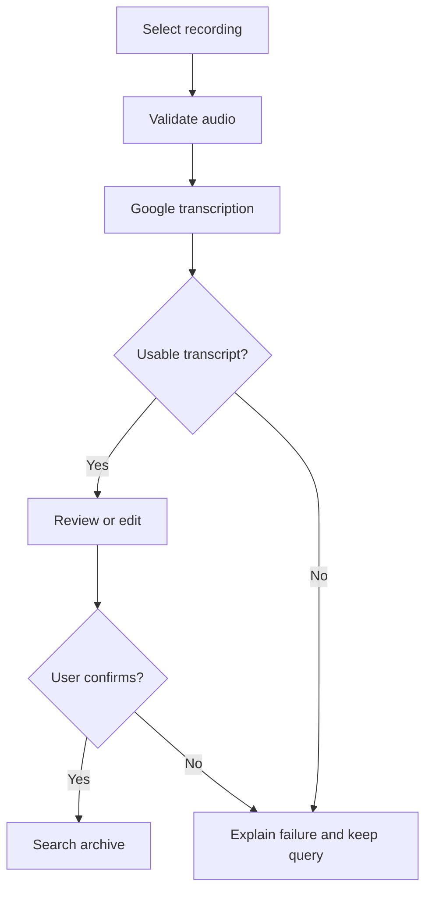

# Voice input feature design

## User need and behavior

Users can provide a spoken query using an existing audio recording. They see
the recognized text and can correct it before search. This reduces keyboard
input for users who prefer speaking while preserving control over the query.

The Google integration is active in the useful workflow: recording, cloud
transcription, review, and archive search. The transcription provider supplies the query,
not generated completions. Every displayed search result still comes from an
actual archive record and retains its file path, line number, and Part A score.

## Components

| Component | Responsibility |
| --- | --- |
| `services/speech.py` | Validate WAV audio and wrap the Google SDK behind `Transcriber`. |
| `services/gemini_speech.py` | Call Gemini with an inline WAV and validate its structured transcript. |
| `cli/voice.py` | Collect the path, display the transcript, and return confirmed text or cancellation. |
| `cli/main.py` | Route `/voice`, manage session state, and run confirmed text through `handle_query`. |
| `core/` | Normalize, retrieve, verify, score, and rank archive sentences. |

`Transcriber.transcribe(path, language_code)` returns a `Transcription` with
text, language code, audio duration, elapsed time, and provider label, or raises
`VoiceInputError`. The CLI depends on that interface, enabling offline tests
and future replacement of the service. Only the adapter imports the Google
SDK, and only when voice input is actually used.

Gemini is the default provider; `--voice-provider cloud-speech` selects the
original implementation. Gemini uses its own `GEMINI_API_KEY` and explicitly
selects the Developer API, without ADC or Cloud Speech billing. Requests use
the official `google-genai` SDK, inline `audio/wav`, a transcription-only system
instruction, and a JSON schema with one string field, `transcript`. Language
is a hint; translation is explicitly excluded. The model's text is labeled
AI-generated and must be reviewed before search. This implements voice input
with Gemini, as an alternative to the assignment's Cloud Speech-to-Text example.

The adapter rejects blocked/incomplete responses, unexpected output shapes,
and blank transcripts. It does not execute model output, expose archive tools,
or automatically search. Schema validation does not prove that speech was
recognized accurately: silence or noise can still produce invented words.
Live evaluation and user correction remain necessary.

`review_voice_query(...)` returns a confirmed string or `None`. The next
integration point for the translation teammate is immediately after this
confirmation and before `handle_query`: translate the confirmed string, show
the translated query, and pass the intended query to the chosen mode.
Contextual completion should have its own explicit mode and generated label.

## Design choices

- File input is a small first version that also works in the existing CLI.
  Live microphone capture and streaming recognition are future additions.
- Short, mono PCM WAV recordings allow local format and duration validation
  with Python's standard library. The adapter does not perform conversion.
- A successful voice request replaces the current query. Failed/cancelled
  requests do not append partial speech or overwrite the current query.
- An empty or punctuation-only transcript cannot trigger a search until the
  user supplies searchable text.
- SDK retries are disabled; the recognition RPC uses an explicit timeout.
- Raw API error details are not printed. Messages explain useful next steps.
- Audio is not logged or cached by the application. Sending a selected file to
  Google is disclosed before transcription. Use nonprivate recordings.

## Part A corrections included with this feature

The original search engine returns `edit_type` and `edit_position`, while
ranking previously read `error_type` and `error_index`. This made fuzzy scores
incorrect. Ranking now consumes the actual search metadata (with compatibility
for the older field names). Exact matches retain all query characters;
insertions retain all original query characters; substitutions/deletions lose
one matching query character. Empty normalized queries return no candidates.

The old `tests/test_scoring.py` contained another scoring implementation and
no tests. It has been replaced by real regression checks that exercise the
search-to-ranking handoff. For the Hamlet sentence, `to pe` now scores 6,
`or knot` scores 8, and `or nt` scores 8.

## Remaining limits

The existing index and candidate-generation design is otherwise retained.
Very short/fuzzy queries can be costly; digit/non-English fuzzy correction is
limited by the existing variation alphabet. The existing early stop counts
sentence IDs while ranking deduplicates by original text, which can underfill
results on repeated lines. These are separate follow-up search tasks.

The service language can be configured, but translation and contextual
completion are teammate integrations and are not implemented in this change.
Cloud transcription quality and latency depend on audio, language, network,
and the provider. The feature cannot claim a fixed word error rate without
testing real recordings against the live service.
